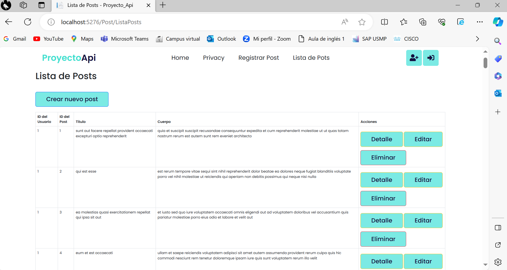

  

## Proyecto sobre como usar APIs

En jesus API 1 hice la primera version

Usando hasta este commit trabaje con la url de jsonplaceholder y pude obtener esta lista que contiene 100 datos es la ruta del post, pero no puedo agregar ni editar ni eliminar por eso ahora creare mi propia api y de la que jalare de mi BD su data para poder mostrarla

http://localhost:5276/swagger/index.html

  

