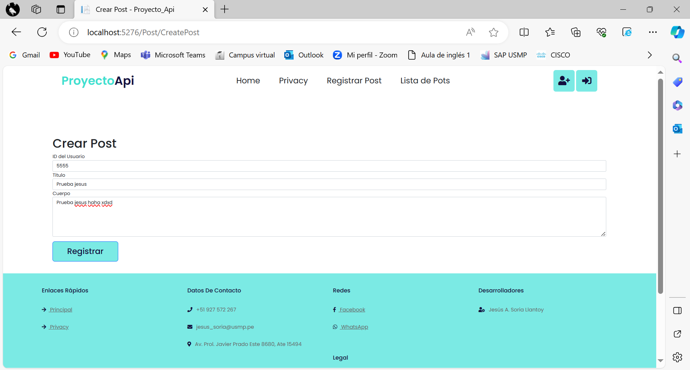
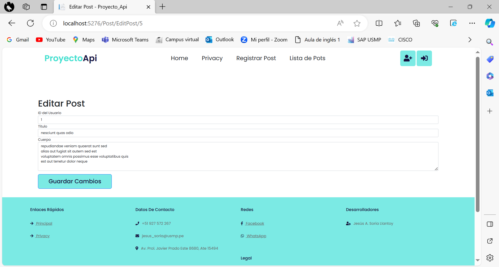
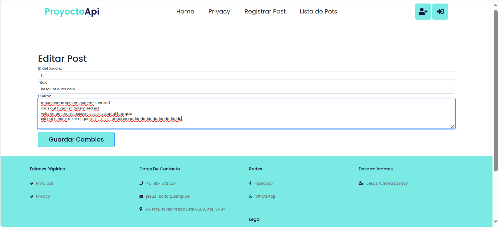
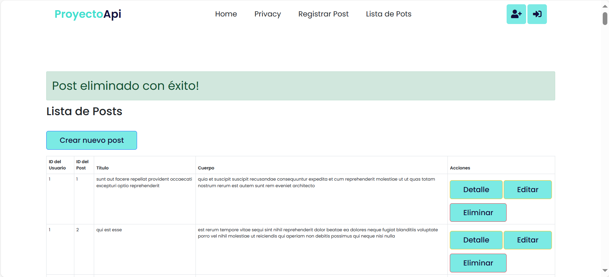
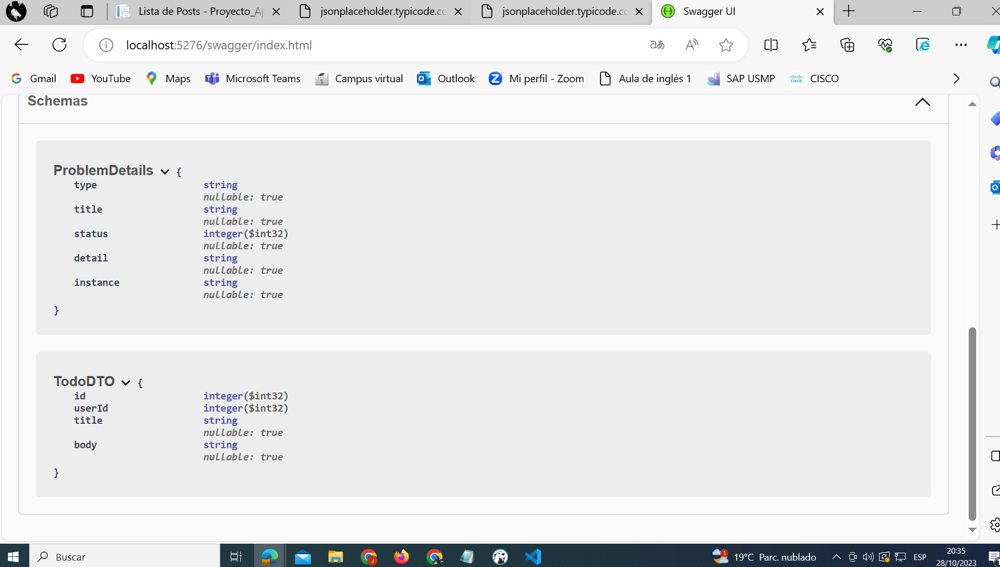

  

# Proyecto sobre como usar APIs

En jesus API 1 hice la primera version

http://localhost:5276/swagger/index.html

## VISTA DE LISTA DE POSTS
En esta vista se muestra los 100 datos de este link https://jsonplaceholder.typicode.com/posts/ 

## VISTA DE REGISTRAR POST
En esta vista se podra registrar un nuevo post

## VISTA DE EDITAR POST
En esta vista se podra editar un post

## VISTA DE MIRAR UN POST
En esta vista se podra mirar un post

## MENSAJE PARA ELIMINAR UN POST
En esta vista se podra mirar un cuadro para confirmar el eliminar un post

## Los 100 datos del jsonplaceholder

## El primer dato del jsonplaceholder

## Generando la documentacion de la API de prueba que hice pero no la use

